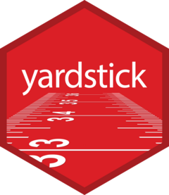

```{r}
#| echo: false
knitr::opts_chunk$set(
  collapse = TRUE,
  comment = "#>",
  fig.path = "man/figures/README-"
)
```

```{r}
#| label: load
#| include: false
#| message: false
#| warning: false
library(yardstick)
library(dplyr)
options(width = 100, digits = 3)
```

# yardstick  

<!-- badges: start -->
[](https://CRAN.R-project.org/package=yardstick)
[](https://CRAN.R-project.org/package=yardstick)
[](https://github.com/tidymodels/yardstick/actions/workflows/R-CMD-check.yaml)
[](https://app.codecov.io/gh/tidymodels/yardstick)
<!-- badges: end -->

## Overview

`yardstick` is a package to estimate how well models are working using [tidy data](https://doi.org/10.18637/jss.v059.i10) principles. See the [package webpage](https://yardstick.tidymodels.org/) for more information.

## Installation

To install the package:

```{r}
#| label: install
#| eval: false
install.packages("yardstick")

# Development version:
# install.packages("pak")
pak::pak("tidymodels/yardstick")
```

## Two class metric

For example, suppose you create a classification model and predict on a new data set. You might have data that looks like this:

```{r}
#| label: class-data
library(yardstick)
library(dplyr)

head(two_class_example)
```

You can use a `dplyr`-like syntax to compute common performance characteristics of the model and get them back in a data frame:

```{r}
#| label: class-metrics
metrics(two_class_example, truth, predicted)

# or

two_class_example |>
  roc_auc(truth, Class1)
```

## Multiclass metrics

All classification metrics have at least one multiclass extension, with many
of them having multiple ways to calculate multiclass metrics.

```{r}
data("hpc_cv")
hpc_cv <- as_tibble(hpc_cv)
hpc_cv
```

```{r}
# Macro averaged multiclass precision
precision(hpc_cv, obs, pred)

# Micro averaged multiclass precision
precision(hpc_cv, obs, pred, estimator = "micro")
```

## Calculating metrics on resamples

If you have multiple resamples of a model, you can use a metric on a grouped
data frame to calculate the metric across all resamples at once.

This calculates multiclass ROC AUC using the method described in Hand, Till (2001),
and does it across all 10 resamples at once.

```{r}
hpc_cv |>
  group_by(Resample) |>
  roc_auc(obs, VF:L)
```

## Autoplot methods for easy visualization

Curve based methods such as `roc_curve()`, `pr_curve()` and `gain_curve()` all
have `ggplot2::autoplot()` methods that allow for powerful and easy visualization.

```{r}
#| label: roc-curves
#| fig-alt: "Faceted ROC curve. 1-specificity along the x-axis, sensitivity along the y-axis. Facets include the classes F, L, M, and VF. Each facet shows 10 lines colored to correspond to a resample. All the lines are quite overlapping. With VF having the tightest and highest values."
library(ggplot2)

hpc_cv |>
  group_by(Resample) |>
  roc_curve(obs, VF:L) |>
  autoplot()
```

## Contributing

This project is released with a [Contributor Code of Conduct](https://contributor-covenant.org/version/2/0/CODE_OF_CONDUCT.html). By contributing to this project, you agree to abide by its terms.

- For questions and discussions about tidymodels packages, modeling, and machine learning, please [post on RStudio Community](https://forum.posit.co/new-topic?category_id=15&tags=tidymodels,question).

- If you think you have encountered a bug, please [submit an issue](https://github.com/tidymodels/yardstick/issues).

- Either way, learn how to create and share a [reprex](https://reprex.tidyverse.org/articles/articles/learn-reprex.html) (a minimal, reproducible example), to clearly communicate about your code.

- Check out further details on [contributing guidelines for tidymodels packages](https://www.tidymodels.org/contribute/) and [how to get help](https://www.tidymodels.org/help/).
