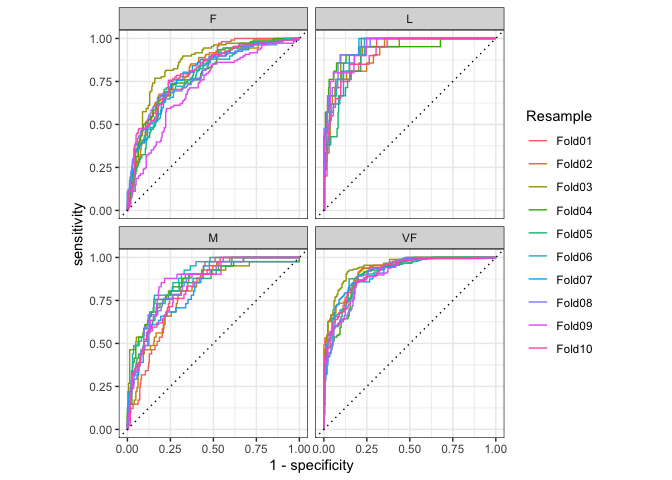

# yardstick 

<!-- badges: start -->

[](https://CRAN.R-project.org/package=yardstick)
[](https://CRAN.R-project.org/package=yardstick)
[](https://github.com/tidymodels/yardstick/actions/workflows/R-CMD-check.yaml)
[](https://app.codecov.io/gh/tidymodels/yardstick)
<!-- badges: end -->

## Overview

`yardstick` is a package to estimate how well models are working using
[tidy data](https://doi.org/10.18637/jss.v059.i10) principles. See the
[package webpage](https://yardstick.tidymodels.org/) for more
information.

## Installation

To install the package:

``` r
install.packages("yardstick")

# Development version:
# install.packages("pak")
pak::pak("tidymodels/yardstick")
```

## Two class metric

For example, suppose you create a classification model and predict on a
new data set. You might have data that looks like this:

``` r
library(yardstick)
library(dplyr)

head(two_class_example)
#>    truth  Class1   Class2 predicted
#> 1 Class2 0.00359 0.996411    Class2
#> 2 Class1 0.67862 0.321379    Class1
#> 3 Class2 0.11089 0.889106    Class2
#> 4 Class1 0.73516 0.264838    Class1
#> 5 Class2 0.01624 0.983760    Class2
#> 6 Class1 0.99928 0.000725    Class1
```

You can use a `dplyr`-like syntax to compute common performance
characteristics of the model and get them back in a data frame:

``` r
metrics(two_class_example, truth, predicted)
#> # A tibble: 2 × 3
#>   .metric  .estimator .estimate
#>   <chr>    <chr>          <dbl>
#> 1 accuracy binary         0.838
#> 2 kap      binary         0.675

# or

two_class_example |>
  roc_auc(truth, Class1)
#> # A tibble: 1 × 3
#>   .metric .estimator .estimate
#>   <chr>   <chr>          <dbl>
#> 1 roc_auc binary         0.939
```

## Multiclass metrics

All classification metrics have at least one multiclass extension, with
many of them having multiple ways to calculate multiclass metrics.

``` r
data("hpc_cv")
hpc_cv <- as_tibble(hpc_cv)
hpc_cv
#> # A tibble: 3,467 × 7
#>    obs   pred     VF      F       M          L Resample
#>    <fct> <fct> <dbl>  <dbl>   <dbl>      <dbl> <chr>   
#>  1 VF    VF    0.914 0.0779 0.00848 0.0000199  Fold01  
#>  2 VF    VF    0.938 0.0571 0.00482 0.0000101  Fold01  
#>  3 VF    VF    0.947 0.0495 0.00316 0.00000500 Fold01  
#>  4 VF    VF    0.929 0.0653 0.00579 0.0000156  Fold01  
#>  5 VF    VF    0.942 0.0543 0.00381 0.00000729 Fold01  
#>  6 VF    VF    0.951 0.0462 0.00272 0.00000384 Fold01  
#>  7 VF    VF    0.914 0.0782 0.00767 0.0000354  Fold01  
#>  8 VF    VF    0.918 0.0744 0.00726 0.0000157  Fold01  
#>  9 VF    VF    0.843 0.128  0.0296  0.000192   Fold01  
#> 10 VF    VF    0.920 0.0728 0.00703 0.0000147  Fold01  
#> # ℹ 3,457 more rows
```

``` r
# Macro averaged multiclass precision
precision(hpc_cv, obs, pred)
#> # A tibble: 1 × 3
#>   .metric   .estimator .estimate
#>   <chr>     <chr>          <dbl>
#> 1 precision macro          0.631

# Micro averaged multiclass precision
precision(hpc_cv, obs, pred, estimator = "micro")
#> # A tibble: 1 × 3
#>   .metric   .estimator .estimate
#>   <chr>     <chr>          <dbl>
#> 1 precision micro          0.709
```

## Calculating metrics on resamples

If you have multiple resamples of a model, you can use a metric on a
grouped data frame to calculate the metric across all resamples at once.

This calculates multiclass ROC AUC using the method described in Hand,
Till (2001), and does it across all 10 resamples at once.

``` r
hpc_cv |>
  group_by(Resample) |>
  roc_auc(obs, VF:L)
#> # A tibble: 10 × 4
#>    Resample .metric .estimator .estimate
#>    <chr>    <chr>   <chr>          <dbl>
#>  1 Fold01   roc_auc hand_till      0.813
#>  2 Fold02   roc_auc hand_till      0.817
#>  3 Fold03   roc_auc hand_till      0.869
#>  4 Fold04   roc_auc hand_till      0.849
#>  5 Fold05   roc_auc hand_till      0.811
#>  6 Fold06   roc_auc hand_till      0.836
#>  7 Fold07   roc_auc hand_till      0.825
#>  8 Fold08   roc_auc hand_till      0.846
#>  9 Fold09   roc_auc hand_till      0.828
#> 10 Fold10   roc_auc hand_till      0.812
```

## Autoplot methods for easy visualization

Curve based methods such as `roc_curve()`, `pr_curve()` and
`gain_curve()` all have `ggplot2::autoplot()` methods that allow for
powerful and easy visualization.

``` r
library(ggplot2)

hpc_cv |>
  group_by(Resample) |>
  roc_curve(obs, VF:L) |>
  autoplot()
```



## Contributing

This project is released with a [Contributor Code of
Conduct](https://contributor-covenant.org/version/2/0/CODE_OF_CONDUCT.html).
By contributing to this project, you agree to abide by its terms.

- For questions and discussions about tidymodels packages, modeling, and
  machine learning, please [post on RStudio
  Community](https://forum.posit.co/new-topic?category_id=15&tags=tidymodels,question).

- If you think you have encountered a bug, please [submit an
  issue](https://github.com/tidymodels/yardstick/issues).

- Either way, learn how to create and share a
  [reprex](https://reprex.tidyverse.org/articles/articles/learn-reprex.html)
  (a minimal, reproducible example), to clearly communicate about your
  code.

- Check out further details on [contributing guidelines for tidymodels
  packages](https://www.tidymodels.org/contribute/) and [how to get
  help](https://www.tidymodels.org/help/).
